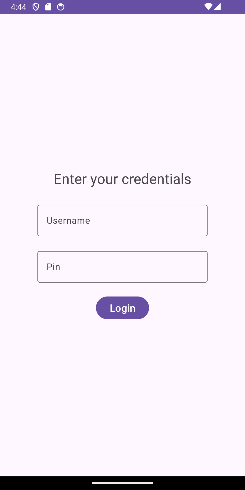
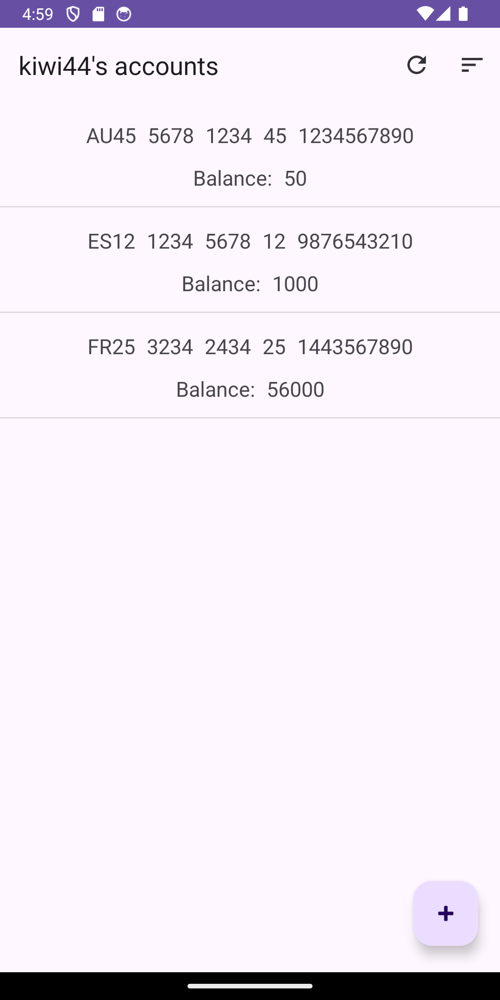
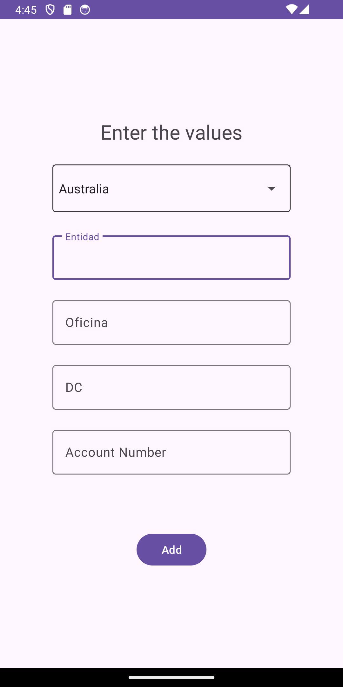
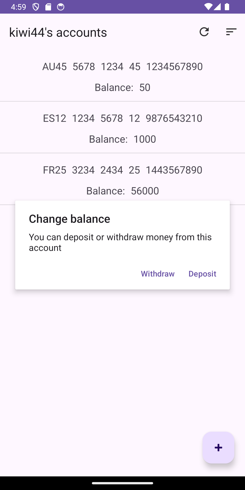
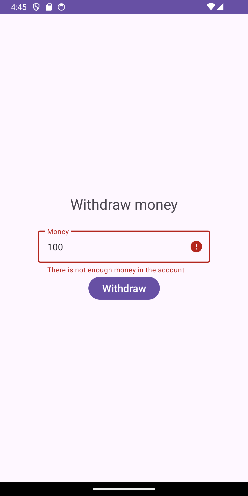
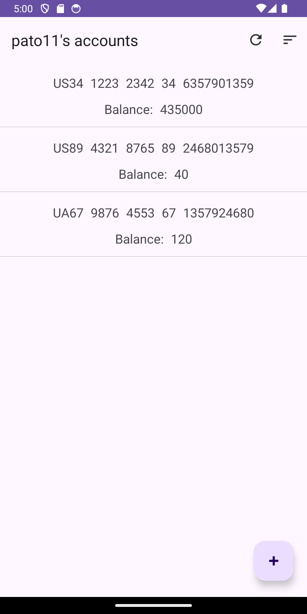

# AppMonedero   

Esta aplicación consiste en poder iniciar como cliente y ver su lista de cuentas. Para poder iniciar sesión hay que introducir un usuario y un pin válido que esté ya guardado en el repositorio.

Cuando el usuario inicie sesión, podrá ver una lista de sus cuentas actuales y el saldo que tenga cada una. También podrá cambiar el orden de menor a mayor saldo y actualizar la lista.

Se puede crear una nueva cuenta, se especifica el país y datos como la entidad, oficina, nº de cuenta, etc. Cuando se añada la nueva cuenta no tendrá saldo, con lo cual se debe depositar dinero. Para ello se puede presionar a la cuenta que se quiera y se podrá elegir entre depositar y retirar. 

Cuando se eliga una de las dos opciones podremos añadir la cantidad de dinero, no obstante, hay que tener cuidado con no añadir o sacar más del límite de fraude, ya que se guardara el movimiento como sospechoso. Si se añade o se saca el doble del límite, directamente se cancelará el movimiento.

<table>
    <tr>
        <th colspan="3">
Screenshots
</th>
    </tr>
    <tr>
        <th></th>
        <th></th>
        <th></th>
    </tr>
    <tr>
        <th></th>
        <th></th>
        <th></th>
    </tr>
</table>
